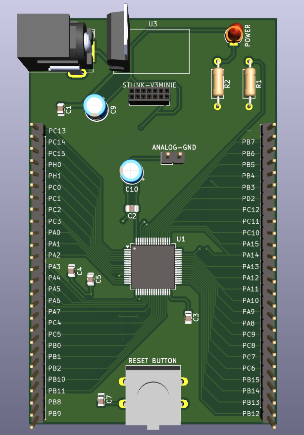

# STM32 Breakout Board

A minimalist development board for STM32, allowing easy connection to the microcontroller and testing its capabilities.

## Project Description
This board is designed for prototyping with STM32 microcontrollers. It enables easy access to processor pins and testing its functions without requiring ready-made kits such as Nucleo or Discovery. The project includes:

- **Microcontroller:** STM32L476RGT6
- **Power Supply:** 5V (barrel connector)
- **Programming:** STLINK-V3MINIE
- **LED Indicators:** Red LED indicating power supply
- **Easy access to GPIO pins**

---

## PCB Rendering
Below is a 3D render generated in KiCad:

    

---

## Real-World Implementation
This is the completed PCB:

    

---

## Presentation
Below is an animated preview of the board in action:

    

---

## Usage Instructions
1. Connect a 5V power supply to the barrel connector.
2. Connect the **STLINK-V3MINIE** programmer.
3. Upload test firmware.
4. Test GPIO pin functionality and develop your applications.

## Author
- **Name**: Krzysztof Tomicki
- **Contact**: tomicki.krzysztof.pv@gmail.com
